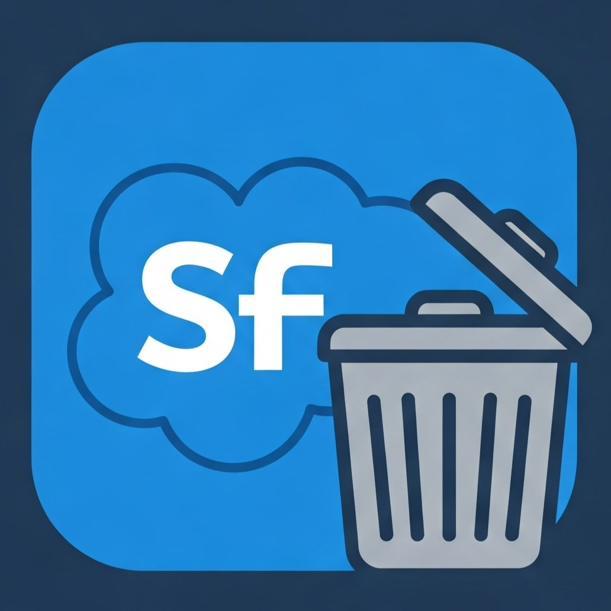

# Salesforce Bulk API Tool (Parallel Bulk Delete) 🚀✨



This project provides a tool to perform parallel bulk deletions on Salesforce objects via the Bulk API 2.0. Use it to remove large amounts of records quickly and efficiently with multi-threading capabilities! ⚡

## Requirements
1. Python 3.6 or later.  
2. Required libraries (listed in requirements.txt):  
   • simple_salesforce  
   • requests  
   • python-dotenv  
   • pandas  
3. Valid Salesforce credentials (SF_USERNAME, PASSWORD, TOKEN).  
4. A .env file containing the environment variables (credentials and configuration).

## Setup ⚙️
1. Clone this repository.  
2. (Optional) Create and activate a virtual environment:  

   ```
   python -m venv venv  
   ```
   • Unix-based systems:  
      ```
       source venv/bin/activate 
      ```
   • Windows:  
      ```
       .\venv\Scripts\activate  
      ```
3. Install the required dependencies:  
   ```
   pip install -r requirements.txt  
   ```
4. Create or edit your .env file based on the .env.example. Make sure to include the following variables:  
   • SF_USERNAME  
   • PASSWORD  
   • TOKEN  
   • DOMAIN (e.g., login or test)  
   • OBJECT_NAME (e.g., Account)  
   • SOQL_QUERY (the query to retrieve the records to delete)
   • BATCH_SIZE (optional, default 10000)
   • MAX_WORKERS (optional, default 5)

Example .env:  
```
SF_USERNAME=your.salesforce.username@example.com  
SF_PASSWORD=your-salesforce-password  
TOKEN=your-salesforce-token  
DOMAIN=test  
OBJECT_NAME=Account  
SOQL_QUERY=SELECT Id FROM Account WHERE LastModifiedDate = YESTERDAY LIMIT 10  
BATCH_SIZE=10000
MAX_WORKERS=5
```
## Usage 🏗️
1. Check the src/example_usage.py file to see how to load config from the .env file and execute the parallel bulk deletion.  
2. Run the script:   
   ```
   python src/example_usage.py  
   ```

A log file named bulk_delete.log will be created, containing details of all parallel operations.  

## Project Structure
- src  
- salesforce_bulk_delete.py: Core logic to connect to Salesforce and manage parallel bulk deletion jobs via the Bulk API 2.0.  
- example_usage.py: Example script demonstrating how to read environment variables and perform parallel bulk deletions.  

## Features 🔥
- Multi-threaded batch processing
- Configurable number of parallel workers
- Adjustable batch sizes
- Thread-safe logging
- Real-time job status monitoring
- Comprehensive operation summaries

## Important Notes 🔒
- Do NOT commit real credentials to public repositories. Use environment variables or a secure vault.  
- Always validate your SOQL query before performing a large-scale deletion.  
- Test in a sandbox or staging environment before running it in production.  
- Monitor system resources when using multiple workers.

## Performance Tips 💡
- Adjust MAX_WORKERS based on your system capabilities and API limits
- Fine-tune BATCH_SIZE according to your data volume
- Monitor Salesforce API usage when running multiple parallel jobs

## License 📝
This project is distributed under the MIT License.  
See: https://opensource.org/licenses/MIT  

Enjoy your Parallel Salesforce Bulk Deletions! 🎉
